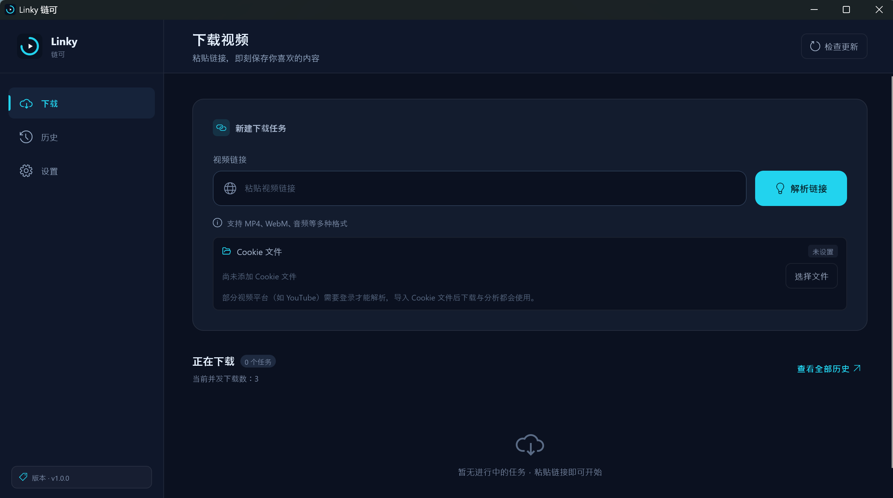
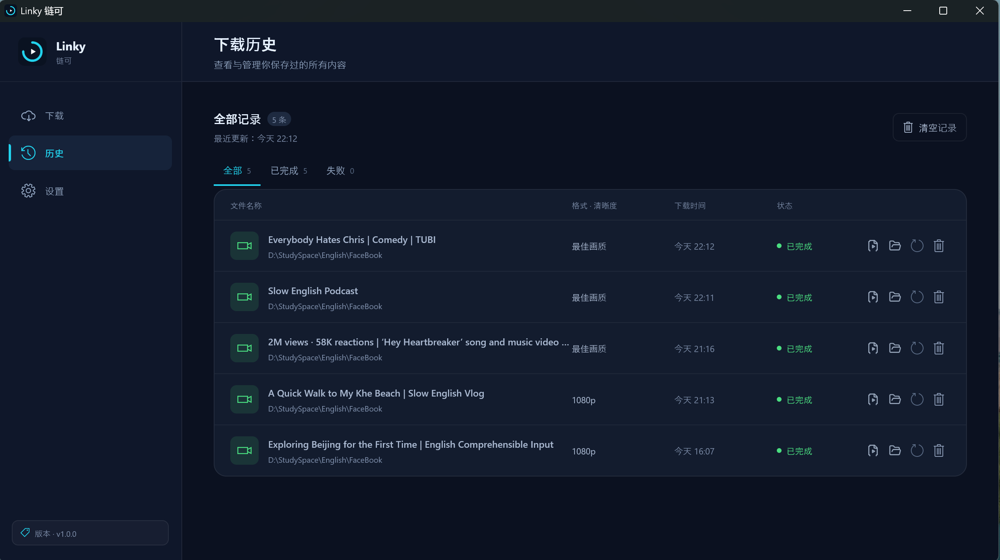
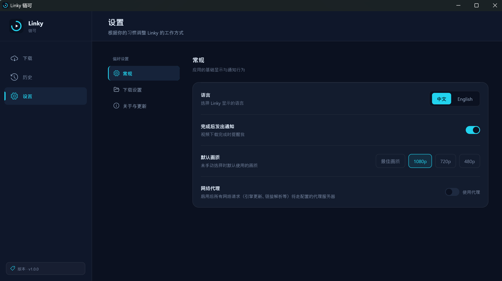

# Linky 链可 · 视频下载器

> 基于 [yt-dlp](https://github.com/yt-dlp/yt-dlp) 的 Windows 桌面视频下载工具。
> 粘贴链接即可解析、选画质、一键下载；引擎在本地运行，数据不出本机。

- 英文名：**Linky** ｜ 中文名：**链可**
- 当前版本：**v1.0.3**
- 运行平台：**Windows 桌面端**（Flutter）
- 核心引擎：**yt-dlp**（解析与下载）+ **FFmpeg**（音视频封装 / 转码）

---

## 更新日志

### v1.0.3

- **关闭行为选择**：点击右上角关闭按钮首次弹出选择（**直接退出** / **退出到系统托盘**），选择持久化，之后点击按所选行为执行。
- **系统托盘支持**：托盘图标左键恢复主窗口；右键菜单提供「打开主界面」与「退出应用」。
- **设置页新增「点击关闭按钮时」**：与「默认画质」同款行内样式，可随时更改或恢复「每次询问」。

### v1.0.2

- 支持 Cookie 文件导入，下载与分析自动带上，适配需登录的平台。
- 历史记录持久化到本地数据库，支持展开播放列表、单独重试某一项。

---

## 界面预览

| 下载 | 历史 | 设置 |
| --- | --- | --- |
|  |  |  |

---

## 核心功能

应用分为三个模块，左侧常驻导航在 **下载 / 历史 / 设置** 之间切换。

### 一、下载

把视频链接交给 Linky，剩下的交给引擎。

- **链接解析**：在链接框粘贴视频地址，自动识别并拉取标题、时长、上传者等信息；支持**单视频**与**播放列表**两种形态。
- **画质选择**：解析完成后选择下载画质，预设如下：

  | 预设 | 说明 |
  | --- | --- |
  | 最佳画质 | 自动选取当前可用的最高画质（音视频自动合并） |
  | 1080p | 最高 1080p |
  | 720p | 最高 720p |
  | 480p | 最高 480p |

- **Cookie 登录**：部分平台（如 YouTube）需要登录后才能解析或下载。直接在本页链接框下方「选择文件」导入 Netscape 格式 Cookie 文件，下载与分析都会带上它；已导入时显示「已添加」徽标，可一键清除。
- **解析失败提示**：当链接解析失败且尚未设置 Cookie 时，链接框下方会给出警示提示，引导你导入 Cookie 后重试。
- **一键下载**：选好画质后入队，下载在后台执行，不影响你继续解析下一个链接。

### 二、历史

所有下载任务集中管理，状态一目了然。

- **任务列表**：记录每条任务的标题、链接、画质标签与状态（排队中 / 下载中 / 已完成 / 失败 / 已取消）。
- **行内操作**（悬停显示）：
  - 打开文件：定位并打开已下载的视频；
  - 打开目录：打开文件所在文件夹；
  - 重试：仅 **失败 / 已取消** 状态可点击，**已完成任务置灰**不可点；
  - 删除：从列表中移除该记录。
- **播放列表展开**：播放列表任务可在历史中展开并单独重试其中某一项。

### 三、设置

- **界面语言**：中文 / English 一键切换，全应用即时生效。
- **默认画质**：设定新下载的默认画质，省去每次手动选择。
- **关闭行为**：自定义点击右上角关闭按钮后的行为（直接退出 / 退出到系统托盘 / 每次询问）。
- **更新检查超时**：配置检查引擎更新时的网络超时阈值。
- **检查更新**：手动检查 **yt-dlp** 与 **FFmpeg** 的新版本，发现可用更新可一键升级。

---

## 技术特性

- **本地优先**：yt-dlp 与 FFmpeg 二进制随应用本地运行，解析与下载不经过任何中转服务器，链接与 Cookie 仅用于访问目标站点。
- **检查更新**：可对比本地引擎版本与上游最新发布，按需升级，无需重装应用。
- **深色界面**：深色主题 + 青色强调色，长时间使用更舒适。
- **响应式布局**：窗口可在较窄宽度下优雅收缩，不依赖固定尺寸。

---

## 附：开发构建

> 面向开发者。普通用户安装后无需关注本节。

### 环境准备

1. 安装 Flutter stable 并启用 Windows 桌面支持（`flutter config --enable-windows-desktop`）
2. **首次构建前必须先下载引擎**（yt-dlp + FFmpeg，约 220MB）：
   ```powershell
   powershell -ExecutionPolicy Bypass -File tool\fetch_engine.ps1
   ```
3. `flutter pub get`
4. `flutter run -d windows`

### 测试

```powershell
flutter test
```

### MSIX 打包

由 dev 依赖 `msix` 提供，配置在 `pubspec.yaml` 的 `msix_config:` 中。生成安装包：

```powershell
flutter pub run msix:create --release
```

产出文件位于 `build\windows\x64\runner\Release\video_downloader.msix`。
签名证书（PFX）需用户提供，不应提交到仓库；未提供时使用 `msix` 自带测试证书签名，仅可用于本机侧载。
